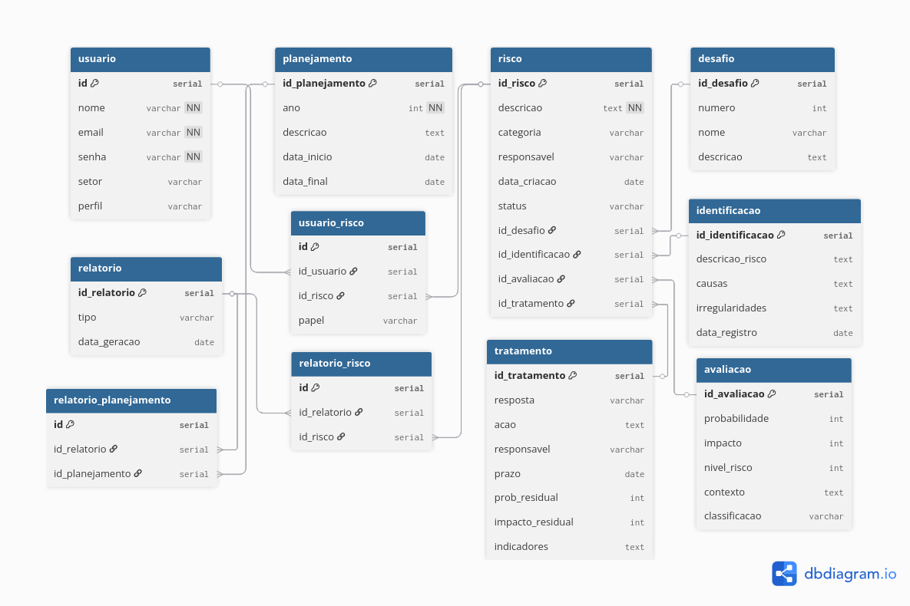

# Como usar

- Tenha instalado o DockerDesktop
- Abra o DockerDesktop
- Siga os passos

## Clone o repositorio
`git clone https://github.com/Rxmosx/GestorDeRisco.git`

## Acesse a pasta GestorDeRisco e use
`docker-compose up --build -d`

## Após os container serem criados e iniciados use o comando a seguir para criar as tabelas do Banco de Dados
`docker-compose exec backend python3.11 manage.py migrate`

### Se necessario rode
`docker-compose restart`

## No navegador acesse http://localhost:5173

## Projeto no Figma: https://www.figma.com/design/AGh7cnJG0QBh9PpLi7pjqv/Gestor-de-Risco?node-id=0-1&t=bYHcgpCLF86ryook-1

## Diagrama de Classes
```mermaid
---
config:
  layout: dagre
  look: neo
  theme: default
---
classDiagram
direction TB
    class Usuario {
	    -Serial id
	    +String nome
	    +String email
	    -String senha
	    +String setor
	    +String perfil
	    +Boolean login()
	    +void logout()
	    +void recuperarSenha()
	    +Risco registrarRisco()
    }

    class Planejamento {
	    -serial id_planejamento
	    +int ano
	    +String descricao
	    +Date data_inicio
	    +Date data_final
	    +void criarPlanejamento()
	    +void encerrar()
	    +List listarDesafios()
    }

    class Risco {
	    -serial id_risco
	    +String descricao
	    +CategoriaRisco categoria
	    +String responsavel
	    +Date data_criacao
	    +StatusRisco Status
	    +int calcularNivel()
	    +void avancarEtapa()
	    +Etapa getEtapaAtual()
    }

    class Desafio {
	    -serial id_desafio
	    +int numero
	    +String nome
	    +String descricao
	    +float calcularProgresso()
	    +List listarRiscos()
    }

    class Relatorio {
	    -serial id_relatorio
	    +String tipo
	    +Date data_geracao
	    +void gerar()
	    +File exportar()
    }

    class Identificacao {
	    -serial id_identificacao
	    +String descricao_risco
	    +String causas
	    +String irregularidades
	    +Date data_registro
	    +void registrar()
	    +Boolean validar()
    }

    class Avaliacao {
	    -serial id_avaliacao
	    +int probabilidade
	    +int impacto
	    -int nivel_risco
	    +String contexto
	    +NivelRisco classificacao
	    +int calcularNivel()
	    -NivelRisco classificar()
    }

    class Tratamento {
	    -serial id_tratamento
	    +RespostaRisco resposta
	    +String acao
	    +String responsavel
	    +Date prazo
	    +int prob_residual
	    +int impacto_residual
	    +String indicadores
	    +void registrar()
	    +void atualizar()
    }

    class MatrizRisco {
        +Grid gerarMatriz()
        +void plotarRiscos()
        +List filtrarPorNivel()
    }

    Usuario -- Planejamento
    Desafio -- Risco
    Risco -- Identificacao
    Risco "0" -- "1" Avaliacao
    Risco "0" -- "1" Tratamento
    Usuario -- Risco
    Planejamento -- Desafio
    Relatorio -- Planejamento

	flowchart LR
    subgraph Caso de Uso
        UC1([Criar Risco])
        UC2([Alterar Risco])
        UC3([Apagar Risco])
        UC4([Consultar Riscos])
        UC7([Gerar Relatório])

        UC5([Gerenciar Usuários])
        UC6([Acessar Banco de Dados])

        UC1 --> UC2
        UC1 --> UC3
        UC1 --> UC4
        UC4 -->|<<include>>| UC7

    end

    Usuario([Usuário])
    Admin([Administrador])

    Usuario --> UC1
    Usuario --> UC2
    Usuario --> UC3
    Usuario --> UC4
    Usuario --> UC7

    Admin --> UC5
    Admin --> UC6
```

## Diagrama do Banco de Dados



# Título do repositório

Descrição curta do repositório.

## Sumário

* [Pré-requisitos](#pré-requisitos)
* [Instalação](#instalação)
* [Instruções de uso](#instruções-de-uso)
* [Contato](#contato)
* [Bibliografia](#bibliografia)

## Pré-requisitos

Descreva aqui brevemente os pré-requisitos necessários para executar o código-fonte. Descreva também
a configuração mínima da máquina em que o código foi desenvolvido, e se alguma configuração em particular é essencial
para sua execução (por exemplo, placa de vídeo dedicada):

| Configuração        | Valor                    |
|---------------------|--------------------------|
| Sistema operacional | Windows 10 Pro (64 bits) |
| Processador         | Intel core i7 9700       |
| Memória RAM         | 16GB                     |
| Necessita rede?     | Sim                      |


## Instalação

Descreva aqui as instruções para instalação das ferramentas para execução do código-fonte: 

```bash
sudo apt-get install nano
```

## Instruções de Uso

Descreva aqui o passo-a-passo que outros usuários precisam realizar para conseguir executar com sucesso o código-fonte
deste projeto:

```bash
echo "olá mundo!"
```

## Contato

O repositório foi originalmente desenvolvido por Fulano: [fulano@ufsm.br]()

## Bibliografia

Adicione aqui entradas numa lista com a documentação pertinente:

* [Documentação coplin-db2](https://pypi.org/project/coplin-db2/)

