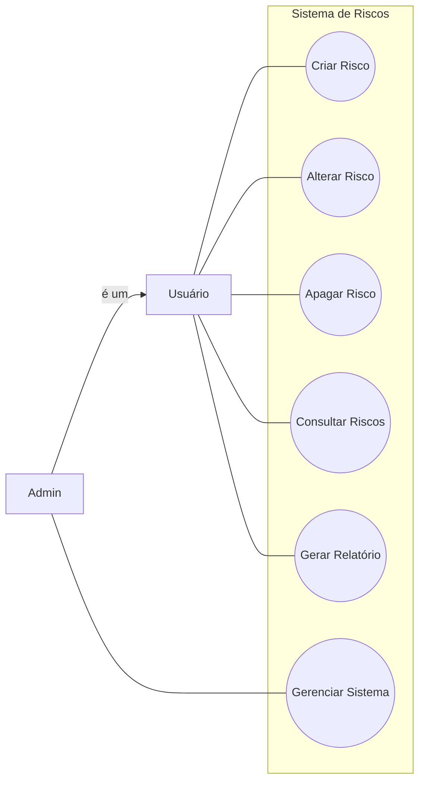
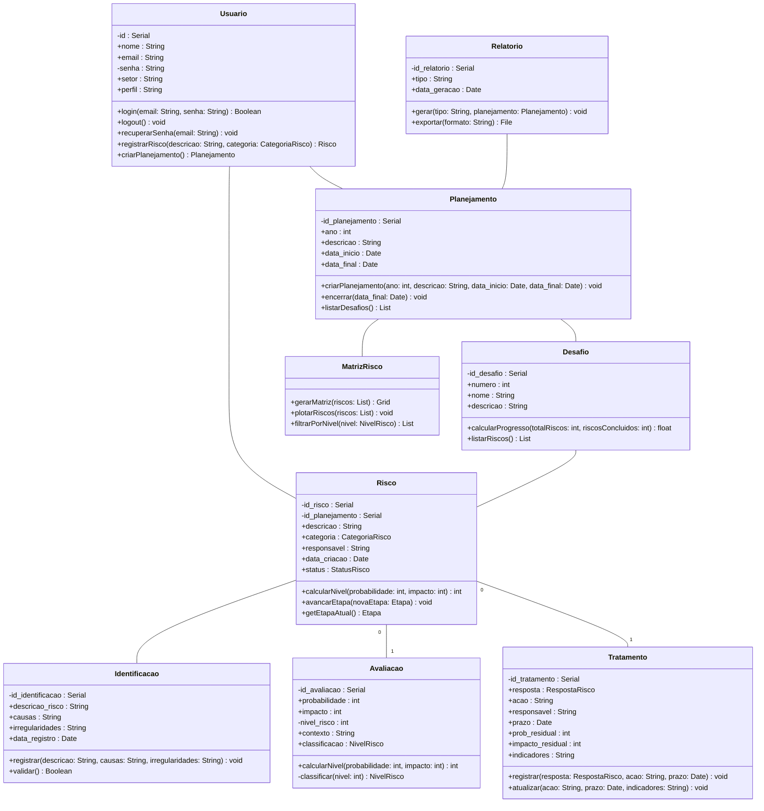

# Como usar

- Tenha instalado o DockerDesktop
- Abra o DockerDesktop
- Siga os passos

## Clone o repositorio
`git clone https://github.com/Rxmosx/GestorDeRisco.git`

## Acesse a pasta GestorDeRisco e use
`docker-compose up --build -d`

## Após os container serem criados e iniciados use o comando a seguir para criar as tabelas do Banco de Dados
`docker-compose exec backend python3.11 manage.py migrate`

### Se necessario rode
`docker-compose restart`

## No navegador acesse http://localhost:5173

## Projeto no Figma: https://www.figma.com/design/AGh7cnJG0QBh9PpLi7pjqv/Gestor-de-Risco?node-id=0-1&t=bYHcgpCLF86ryook-1

## Diagrama caso de uso



## Diagrama de Classes


## Diagrama do Banco de Dados


# Título do repositório

Descrição curta do repositório.

## Sumário

* [Pré-requisitos](#pré-requisitos)
* [Instalação](#instalação)
* [Instruções de uso](#instruções-de-uso)
* [Contato](#contato)
* [Bibliografia](#bibliografia)

## Pré-requisitos

Descreva aqui brevemente os pré-requisitos necessários para executar o código-fonte. Descreva também
a configuração mínima da máquina em que o código foi desenvolvido, e se alguma configuração em particular é essencial
para sua execução (por exemplo, placa de vídeo dedicada):

| Configuração        | Valor                    |
|---------------------|--------------------------|
| Sistema operacional | Windows 10 Pro (64 bits) |
| Processador         | Intel core i7 9700       |
| Memória RAM         | 16GB                     |
| Necessita rede?     | Sim                      |


## Instalação

Descreva aqui as instruções para instalação das ferramentas para execução do código-fonte: 

```bash
sudo apt-get install nano
```

## Instruções de Uso

Descreva aqui o passo-a-passo que outros usuários precisam realizar para conseguir executar com sucesso o código-fonte
deste projeto:

```bash
echo "olá mundo!"
```

## Contato

O repositório foi originalmente desenvolvido por Fulano: [fulano@ufsm.br]()

## Bibliografia

Adicione aqui entradas numa lista com a documentação pertinente:

* [Documentação coplin-db2](https://pypi.org/project/coplin-db2/)

